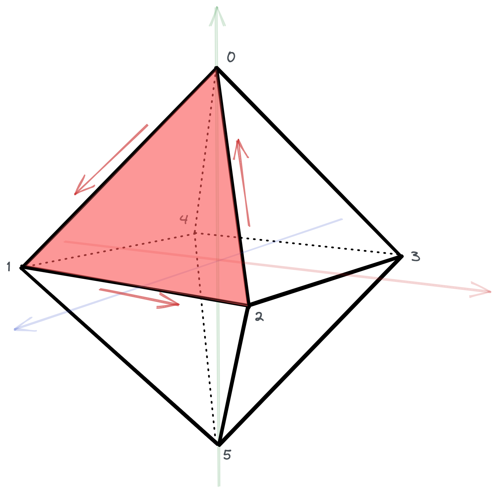

# Sample AR App

This folder contains basic AR examples showcasing scene creation, custom geometry, body tracking etc.

> _Note: You are advised to read this file alongside with the code opened in Xcode._

# Examples

## Custom Scene

Shows how you can create a custom scene.

By default the [`ARSCNView`](https://developer.apple.com/documentation/arkit/arscnview/) will create an empty scene. To load the the AR view with custom you need to assign [`SCNScene`](https://developer.apple.com/documentation/scenekit/scnscene/) instance to the view.

```swift
let scene = SCNScene(named: "Path to .scn file")
sceneView.scene = scene
```

## Custom Geometry

Scenekit comes with predefined set of primitive shapes. You can combine multiple primitive shapes to create a new one (e.g., a snowman could be shaped as a combination of three spheres); however, sometimes we need to display shapes that cannot be simply created from those primitives. In such case, we can create a custom [`SCNGeometry`](https://developer.apple.com/documentation/scenekit/scngeometry).

### From Bezier Path

With [`SCNShape`](https://developer.apple.com/documentation/scenekit/scnshape)'s convenience initialization we are able to pass in any [`UIBezierPath`](https://developer.apple.com/documentation/uikit/uibezierpath) that will represent an object's final shape.

### From Vertices

This example shows how you can create a simple [octahedron](https://en.wikipedia.org/wiki/Octahedron).

Geometry, also known as [mesh](https://en.wikipedia.org/wiki/Polygon_mesh), is represented by a collection of vertices. With the ability to describe these vertices, we are able to define how the geometry will be shaped. We can use the [`init(sources:elements:)`](https://developer.apple.com/documentation/scenekit/scngeometry/1522803-init) to do so.

Firstly, we need to satisfy the first parameter, that is define the sources, which describe an attribute of all vertices (vertex position, surface normal vector, texture mapping coordinates, ...). 

An octahedron is consisted of 6 vertices.

```swift
// Vertices ordered from 0 to 5 as shown in the picture below
let vertices = [...]
```

<p align="center"></p>

Secondly, we need to describe the relationship between the vertices (elements) by defining an array of indices that will help SceneKit understand how to combine the vertices into polygons (triangles). Note that the order of indices matter. A front face is defined by counter-clockwise order.

<p align="center"></p>

The image above shows the order of vertices (indices) that defines the highlighted triangle — [0, 1, 2]. The same triangle could be defined as [1, 2, 0] or [2, 0, 1] as long as it is in counter-clockwise.

```swift
let indices: [Int32] = [
    0, 1, 2,
    2, 3, 0,
    3, 4, 0,
    4, 1, 0,
    1, 5, 2,
    2, 5, 3,
    3, 5, 4,
    4, 5, 1
]
```

What remains to do is to create geometry sources and elements.

```swift
let verticesSource = SCNGeometrySource(vertices: vertices)
let indicesElement = SCNGeometryElement(indices: indices, primitiveType: .triangles)
```

Note that the [`primitiveType`](https://developer.apple.com/documentation/scenekit/scngeometryprimitivetype/) is set as [`triangles`](https://developer.apple.com/documentation/scenekit/scngeometryprimitivetype/triangles). There are other primitive types to describe the geometry's element data. With each type there is a different way how indices should be defined. For instance, [`SCNGeometryPrimitiveType.polygon`](https://developer.apple.com/documentation/scenekit/scngeometryprimitivetype/polygon) is defined by a sequence of four indices.

Finally, the whole geometry is created with the following code:

```swift
let geometry = SCNGeometry(
    sources: [verticesSource]
    elements: [indicesElement]
)
```

## Plane Detection

Plane detection enables the running AR session to detect flat surfaces. Enable this functionality by passing a value to the sessions configuration [`planeDetection`](https://developer.apple.com/documentation/arkit/arbodytrackingconfiguration/3194574-planedetection/) property.

```swift
configuration.planeDetection = [.horizontal, .vertical]
sceneView.session.run(configuration)
```

When a flat surface is detected the [`ARSCNViewDelegate`](https://developer.apple.com/documentation/arkit/arscnviewdelegate/) method [`renderer(_:didAdd:for:)`](https://developer.apple.com/documentation/arkit/arscnviewdelegate/2865794-renderer) is called. Here we want to filter out only [`ARPlaneAnchor`](https://developer.apple.com/documentation/arkit/arplaneanchor/), for which we will create a node to represent the detected plane's mesh.

Then each time the node for the [`ARPlaneAnchor`](https://developer.apple.com/documentation/arkit/arplaneanchor/) is updated, we need to obtain an updated anchor geometry and update the node's geometry with it.

## Body Tracking

This example shows the minimal setup to start detecting body parts. The most important thing is to run the session with [`ARBodyTrackingConfiguration`](https://developer.apple.com/documentation/arkit/arbodytrackingconfiguration).

After that each time a body part is detected, an anchor for the body's skeleton will be added and updated. When such anchor is updated, the [`ARSessionDelegate`](https://developer.apple.com/documentation/arkit/arsessiondelegate/) delegate method [`session(_:didUpdate:)`](https://developer.apple.com/documentation/arkit/arsessiondelegate/2865624-session) is called. There we are able to iterate through the given anchors and work with them as needed.

Note that the root of the body skeleton is the body anchor, therefore all other parts of the skeleton have a relative relationship to the root.

## Vision

This example shows how we can easily detect human hand pose, specifically detect the index finger and its tip on the human hand.

The steps are more or less straightforward — all numbered and commented so that you can easily follow them.

However, there are a few things you need to keep in mind when working with Vision.

- Experimenting with incoming image frames and Vision requests we will come to realize that the orientation of the captured image is in a horizontal position. Therefore, when creating a [`VNImageRequestHandler`](https://developer.apple.com/documentation/vision/vnimagerequesthandler/), we need to set the orientation to [`CGImagePropertyOrientation.right`](https://developer.apple.com/documentation/imageio/cgimagepropertyorientation/), which says that the captured image is rotated 90° clockwise from the image's intended display orientation.
- Vision has a different coordinate system from UIKit, i.e. the (x, y) coordinates of the origin point is at the leftmost bottom corner. Pixel (x, y) positions increase bottom-to-top, left-to-right.
- The captured image—and consequently the image that Vision is working with—has different aspect ratio than the device's screen. Thus, for instance, a normalized coordinates (0.1, 0.1) might not be visible on the device's screen. See [CoordinatesAdapter](#coordinatesadapter).

<br/>

# CoordinatesAdapter

[`CoordinatesAdapter`](https://github.com/strvcom/ios-course-mendelu-2022-autumn/blob/cc56a1142fd64116338f4aeee80329f92d47b7aa/Augmented%20Reality/SampleARApp/SampleARApp/Utils/CoordinatesAdapter.swift#L10) is a helper struct that converts normalized points in the Vision's coordinate system to the screen (UIKit's) coordinate system while taking into account the aspect ratios of the captured image (4:3) and the device's screen (19.5:9 on iPhone 13 Pro).

To help us understand better what is happening in the adapter, see below picture.

<p align="center"></p>

